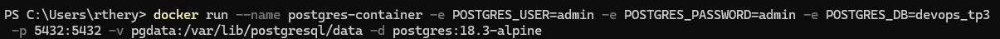
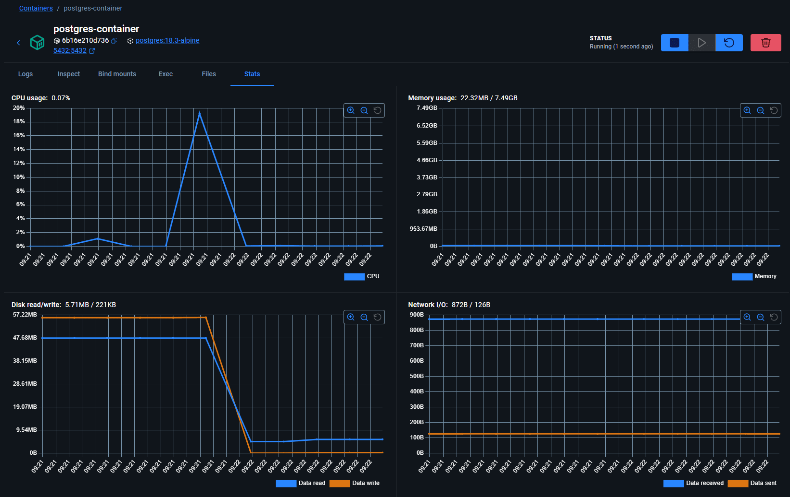
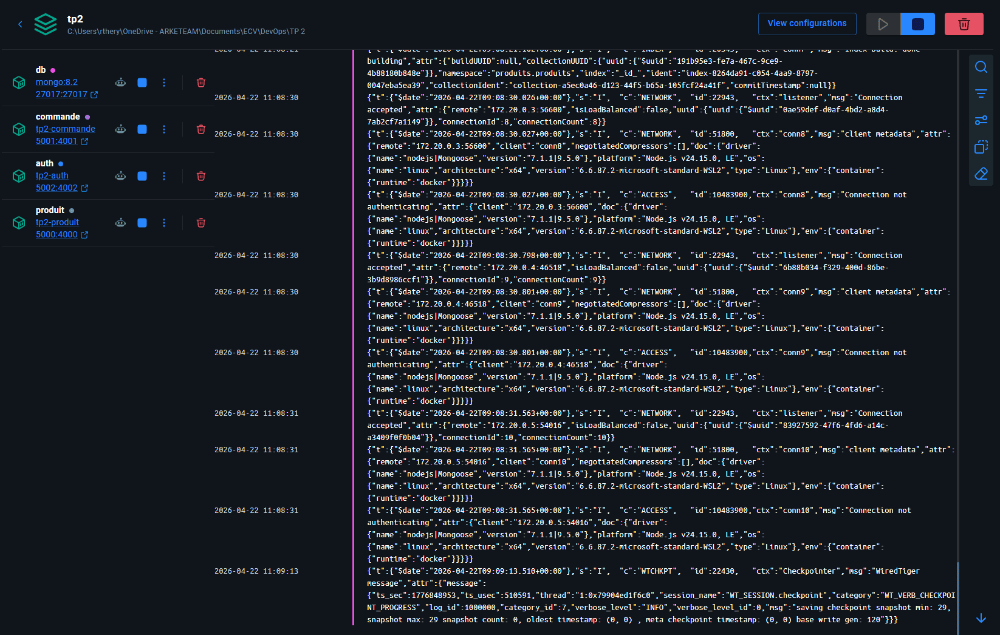
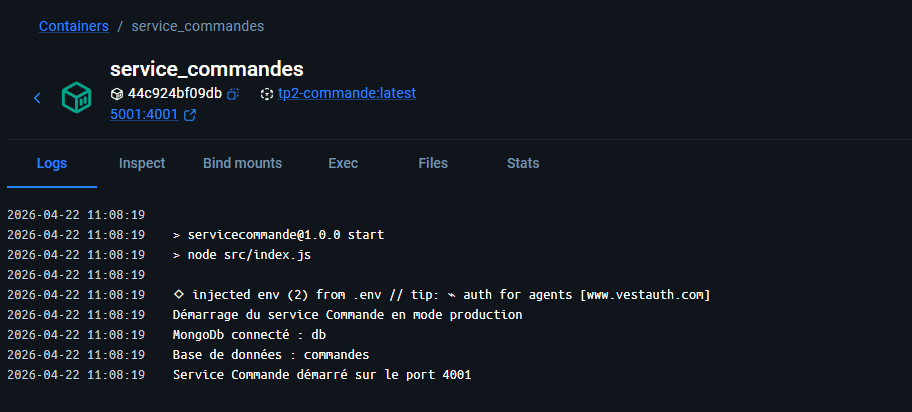
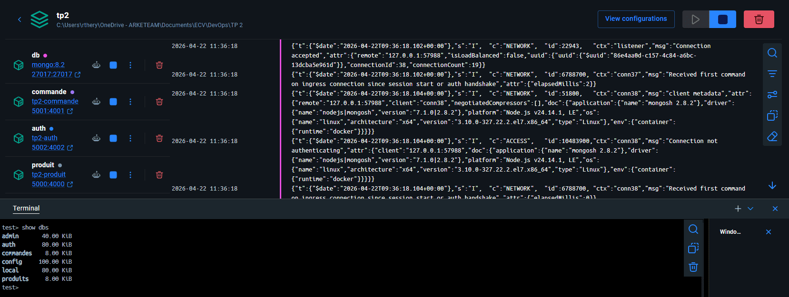
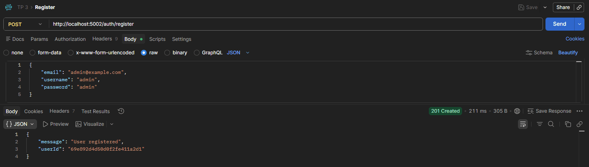
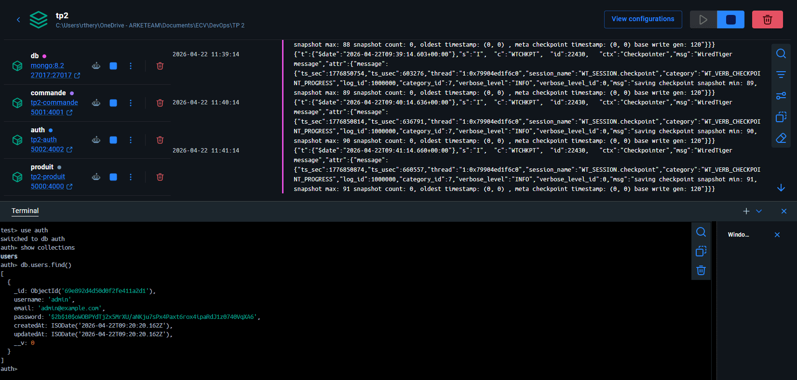

# Conteneurisation d'une architecture en microservices avec Docker et Docker Compose
### ECV - M1 Dev - Master Lead Developement Frontend 2025 - 2026
### DevOps TP 3 - Intervenant : Yaya DOUMBIA
### Romain THÉRY
---

## Introduction :

Ce projet vise à conteneuriser l'architecture en microservices du TP 2 en utilisant Docker et Docker Compose. Les objectifs sont :

1. **Comprendre la conteneurisation** :  
Manipuler les conteneurs Docker et les images de base officielles
2. **Créer des Dockerfile** :  
Construire des images Docker pour chaque microservice (Produit, Commande, Authentification)
3. **Orchestrer les services** :  
Utiliser Docker Compose pour gérer les services interdépendants
4. **Gérer les configurations** :  
Configurer les variables d'environnement et les volumes pour la persistance des données
5. **Tester l'intégration** :  
Vérifier que tous les services communiquent correctement dans les conteneurs

---

## Étape 1 : Manipulation d'un conteneur

### Création d'un conteneur PostgreSQL

- Création d'un conteneur PostgreSQL avec configuration personnalisée :

```ps1
docker run --name postgres-container -e POSTGRES_USER=admin -e POSTGRES_PASSWORD=admin -e POSTGRES_DB=devops_tp3 -p 5432:5432 -v pgdata:/var/lib/postgresql/data -d postgres:18.3-alpine
```

**Paramètres utilisés** :
- `--name postgres-container` : Nom du conteneur
- `-e` : Variables d'environnement (utilisateur, mot de passe, base de données)
- `-p 5432:5432` : Mappage des ports (conteneur:host)
- `-v pgdata:/var/lib/postgresql/data` : Volume pour la persistance des données
- `-d` : Lancer en mode détaché (arrière-plan)



### Gestion du cycle de vie du conteneur

- Redémarrage du conteneur :

```ps1
docker restart 6b16e210d736ff12c4550dc607886fb2baa4f4aefca74c1bd17d9507428e037e
```

- Arrêt du conteneur :

```ps1
docker stop 6b16e210d736ff12c4550dc607886fb2baa4f4aefca74c1bd17d9507428e037e
```



---

## Étape 2 : Création des Dockerfiles

### Structure des services à conteneuriser

Trois microservices doivent être conteneurisés :
- **AuthService** : Service d'authentification JWT
- **ServiceProduit** : Gestion des produits
- **ServiceCommande** : Gestion des commandes

### Dockerfile du service Authentification (AuthService)

```dockerfile
ARG NODE_VERSION=24.15.0

FROM node:${NODE_VERSION}-alpine

WORKDIR /usr/src/app

RUN --mount=type=bind,source=package.json,target=package.json \
    --mount=type=bind,source=package-lock.json,target=package-lock.json \
    --mount=type=cache,target=/root/.npm \
    npm ci --omit=dev

USER node

COPY . .

CMD [ "npm", "run", "start" ]
```

**Explications** :
- `ARG NODE_VERSION=24.15.0` : Déclare une variable de build pour la version de Node.js
- `FROM node:${NODE_VERSION}-alpine` : Utilise une image Node.js légère basée sur Alpine Linux avec la version spécifiée
- `WORKDIR /usr/src/app` : Définit le répertoire de travail dans le conteneur
- `RUN --mount=type=bind...` : Utilise les BuildKit mounts pour optimiser le build Docker
  - `type=bind` : Monte les fichiers package.json et package-lock.json
  - `type=cache` : Met en cache les téléchargements npm pour accélérer les builds
- `npm ci --omit=dev` : Installe les dépendances de production uniquement (omit=dev exclut les devDependencies)
- `USER node` : Change l'utilisateur pour exécuter le conteneur en tant que node (meilleure sécurité)
- `COPY . .` : Copie tout le contenu du projet dans le répertoire de travail
- `CMD [ "npm", "run", "start" ]` : Commande à exécuter au démarrage du conteneur


### Les Dockerfiles des services Produits et Commandes sont les mêmes

---

## Étape 3 : Conteneurisation des services Produit, Commande & Auth avec Docker Compose

### Configuration complète du fichier docker-compose.yml

Docker Compose permet d'orchestrer plusieurs conteneurs et leur communication. Voici la configuration complète :

```yaml
services:
  db:
    container_name: db
    restart: unless-stopped
    image: mongo:8.2
    ports:
      - "27017:27017"
    volumes:
      - ./data:/data/db
    healthcheck:
      test: [ "CMD", "mongosh", "--eval", "db.adminCommand('ping').ok", "--quiet" ]
      interval: 10s
      timeout: 5s
      retries: 3
      start_period: 15s
  
  auth:
    container_name: service_auth
    restart: unless-stopped
    build: ./AuthService
    environment:
      - NODE_ENV=production
      - PORT=4002
      - MONGODB_URI=mongodb://db:27017/auth
      - JWT_SECRET=__your__jwt__secret__
      - JWT_EXPIRES_IN=1d
    ports:
      - "5002:4002"
    volumes:
      - /app/node_modules
    depends_on:
      db:
        condition: service_healthy
  
  produit:
    container_name: service_produits
    restart: unless-stopped
    build: ./ServiceProduit
    environment:
      - MONGODB_URI=mongodb://db:27017/produits
    ports:
      - "5000:4000"
    volumes:
      - /app/node_modules
    depends_on:
      db:
        condition: service_healthy
  
  commande:
    container_name: service_commandes
    restart: unless-stopped
    build: ./ServiceCommande
    environment:
      - MONGODB_URI=mongodb://db:27017/commandes
      - SERVICE_PRODUIT_URL=http://service_produits:4000
    ports:
      - "5001:4001"
    volumes:
      - /app/node_modules
    depends_on:
      db:
        condition: service_healthy
  
volumes:
  data:
```

### Explication de la configuration

**Service MongoDB (db)** :
- Image MongoDB 8.2 pour la base de données centralisée
- Volume `./data:/data/db` pour la persistance des données
- Health check pour vérifier que la base est opérationnelle avant de démarrer les autres services
- Port 27017 exposé pour les connexions externes

**Service Authentification (auth)** :
- Build depuis le Dockerfile du répertoire `./AuthService`
- Port 5002 sur l'hôte mapped vers port 4002 du conteneur
- Dépend du service `db` avec condition `service_healthy`
- Variables d'environnement pour JWT et MongoDB

**Service Produit (produit)** :
- Build depuis le Dockerfile du répertoire `./ServiceProduit`
- Port 5000 sur l'hôte mapped vers port 4000 du conteneur
- Dépend du service `db`

**Service Commande (commande)** :
- Build depuis le Dockerfile du répertoire `./ServiceCommande`
- Port 5001 sur l'hôte mapped vers port 4001 du conteneur
- URL du service Produit configurée via la variable d'environnement `SERVICE_PRODUIT_URL`

### Lancement de l'orchestration

- Démarrage de tous les services :

```
docker-compose up -d
```

- Arrêt de tous les services :

```
docker-compose down
```

- Visualisation des logs :

```
docker-compose logs -f
```

---

## Étape 4 : Tests et vérification de l'intégration

### Vérification des conteneurs en cours d'exécution

```
docker ps
```

Ou depuis DockerDesktop :



Conteneur du Service de commande :



### Accès aux services

Une fois les conteneurs lancés, les services sont accessibles via :
- **Service Produit** : `http://localhost:5000`
- **Service Commande** : `http://localhost:5001`
- **Service Auth** : `http://localhost:5002`
- **MongoDB** : `mongodb://localhost:27017`

### Liste des bases créées

Accessibles avec :
```
show dbs
```




Ou consultables grâce à MongoDB Compass

### Tests avec Postman

Les mêmes endpoints que le TP 2 sont maintenant disponibles via Docker :
- `POST http://localhost:5000/produits` : Ajouter un produit
- `GET http://localhost:5000/produits/acheter` : Récupérer les produits
- `POST http://localhost:5001/commandes` : Ajouter une commande
- `POST http://localhost:5002/register` : Enregistrer un utilisateur
- `POST http://localhost:5002/login` : Se connecter

### Test de création d'un utilisateur en appelant le service Auth :



Vérification en base de la création de l'utilisateur :




---

## Conclusion

La conteneurisation des microservices avec Docker et Docker Compose permet :
- **Portabilité** : Les services fonctionnent de la même manière sur tout environnement Docker
- **Scalabilité** : Facile d'ajouter ou de retirer des instances
- **Isolation** : Chaque service fonctionne dans son propre conteneur
- **Orchestration** : Docker Compose gère automatiquement les dépendances et la communication
- **Persistance** : Les données MongoDB sont conservées dans les volumes
