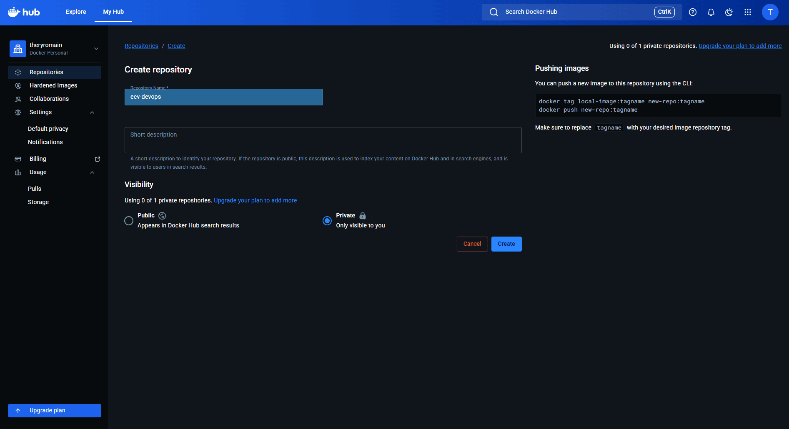
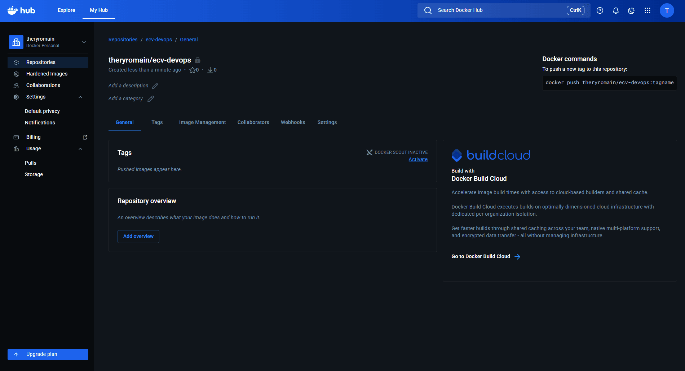

# Déploiement d'une application en micro-service sur Azure
### ECV - M1 Dev - Master Lead Developement Frontend 2025 - 2026
### DevOps TP 4 - Intervenant : Yaya DOUMBIA
### Romain THÉRY
---

## Introduction

### Objectifs
- Création et envoi (push) d’une image Docker sur Docker Hub
- Définition de « Azure App Service »
- Déployer une application multi-conteneur en Azure App service

## WIP

### Mise en place du repository sur DockerHub

Création du repository sur DockerHub pour héberger les images Docker des microservices.



Vue générale du repository après création, prêt à recevoir les images



### Création du service "Frontend"

Création du service "Frontend" avec Express.js, qui servira de point d'entrée pour les utilisateurs et communiquera avec les autres microservices.


Contenu html (`index.html`) :

```html
<body>
    <nav>
        <ul>
            <li>Catalogue</a></li>
            <li>Contact</li>
            <li>Profile</li>
        </ul>
    </nav>
    <h1>
        Bienvenue sur notre site e-commerce !
    </h1>
</body>
```

Code serveur (`index.js`) :

```js
import dotenv from 'dotenv';
import express from 'express';

// Load environment variables
dotenv.config();
console.info('Démarrage du service Frontend en mode', process.env.NODE_ENV);

// Server setup
const PORT = process.env.PORT || 3000;
const app = express();

app.listen(PORT, () => {
    console.log(`Service Frontend démarré sur le port ${PORT}`);
});

app.use(express.json());

app.get('/', (_, res) => {
    res.status(200).sendFile('index.html', { root: './public' });
});
```

### Modification du docker-compose

Ajout du service "Frontend" dans le fichier `docker-compose.yml` pour permettre son déploiement et sa communication avec les autres microservices.

```yml
frontend:
  build: ./ServiceFrontend
  container_name: service_frontend
  ports:
    - "8080:4003"
  restart: unless-stopped
    volumes:
      - /app/node_modules
```

On modifie le fichier `docker-compose.yml` pour utiliser les images Docker hébergées sur Docker Hub, si les images sont déjà poussées, sinon on peut les construire localement et les pousser ensuite.

```yml
#...

auth:
  image: theryromain/ecv-devops:auth-0.1

#...

produit:
  image: theryromain/ecv-devops:produit-0.1

#...

commande:
  image: theryromain/ecv-devops:commande-0.1

#...

frontend:
  image: theryromain/ecv-devops:frontend-0.1

#...
```

### Vérification du bon fonctionnement des conteneurs

Lancement des conteneurs avec `docker-compose up` et vérification que tous les services sont opérationnels.

```bash
docker-compose up
```

screen

On vérifie que les images ont été créées avec les bons tags

```bash
docker images
```

screen

Accès à l'application via le navigateur à l'adresse `http://localhost:8080` pour vérifier que le service "Frontend" fonctionne correctement et affiche la page d'accueil.

screen


---

## Conclusion

### WIP